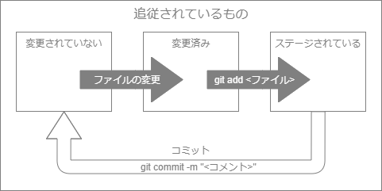

# 教材(Git)

- [教材(Git)](#%e6%95%99%e6%9d%90git)
  - [Git](#git)
  - [[WIP] 初期設定](#wip-%e5%88%9d%e6%9c%9f%e8%a8%ad%e5%ae%9a)
  - [リポジトリの作成](#%e3%83%aa%e3%83%9d%e3%82%b8%e3%83%88%e3%83%aa%e3%81%ae%e4%bd%9c%e6%88%90)
    - [リポジトリの作成: 問題](#%e3%83%aa%e3%83%9d%e3%82%b8%e3%83%88%e3%83%aa%e3%81%ae%e4%bd%9c%e6%88%90-%e5%95%8f%e9%a1%8c)
  - [変更内容の記録](#%e5%a4%89%e6%9b%b4%e5%86%85%e5%ae%b9%e3%81%ae%e8%a8%98%e9%8c%b2)
    - [変更内容の記録: 問題 1](#%e5%a4%89%e6%9b%b4%e5%86%85%e5%ae%b9%e3%81%ae%e8%a8%98%e9%8c%b2-%e5%95%8f%e9%a1%8c-1)
  - [ブランチによる分岐と統合](#%e3%83%96%e3%83%a9%e3%83%b3%e3%83%81%e3%81%ab%e3%82%88%e3%82%8b%e5%88%86%e5%b2%90%e3%81%a8%e7%b5%b1%e5%90%88)
  - [ブランチによる分岐と統合: 問題 1](#%e3%83%96%e3%83%a9%e3%83%b3%e3%83%81%e3%81%ab%e3%82%88%e3%82%8b%e5%88%86%e5%b2%90%e3%81%a8%e7%b5%b1%e5%90%88-%e5%95%8f%e9%a1%8c-1)
  - [ブランチによる分岐と統合: 問題 2](#%e3%83%96%e3%83%a9%e3%83%b3%e3%83%81%e3%81%ab%e3%82%88%e3%82%8b%e5%88%86%e5%b2%90%e3%81%a8%e7%b5%b1%e5%90%88-%e5%95%8f%e9%a1%8c-2)
  - [[WIP] コミットのやり直し](#wip-%e3%82%b3%e3%83%9f%e3%83%83%e3%83%88%e3%81%ae%e3%82%84%e3%82%8a%e7%9b%b4%e3%81%97)
  - [[WIP] コミットの取り消し](#wip-%e3%82%b3%e3%83%9f%e3%83%83%e3%83%88%e3%81%ae%e5%8f%96%e3%82%8a%e6%b6%88%e3%81%97)

## Git

Git とは、ファイルの変更履歴を記録できる `分散型バージョン管理システム` の 1 つです。バージョン管理システムでは、好きなタイミングで変更履歴を記録できます。記録する際にコメントをつけることができるので、どういう意図で編集したのかがわかります。そして、履歴により過去の状態に戻すこともできます。

## [WIP] 初期設定

docker で設定済みにしておくか、設定してもらうか
どっちにしろ書く

## リポジトリの作成

Git の操作を行うためには、行う場所が Git のリポジトリ内である必要があります。リポジトリとは、 Git が見ることのできるプロジェクトのようなものです。リポジトリ内ではファイルの変更を読み取ることができ、記録の履歴を見ることができます。

### リポジトリの作成: 問題

まずは、 Git 用のディレクトリを作ってみましょう。ディレクトリを生成してディレクトリ内に入る際は以下のコマンドを使用します。 ( `# 以降はコメント` なので入力しなくても大丈夫です。)

```bash
mkdir hello-git # ディレクトリの作成
cd hello-git # ディレクトリ内に移動
```

そして、作成したディレクトリを Git のリポジトリとして初期化してみましょう。

```bash
git init
```

成功すると、このように出力されます。→ `Initialized empty Git repository in hello-git`

## 変更内容の記録

リポジトリ内の各ファイルには、 Git から追跡されているもの(tracked)と追跡されていないもの(untracked)の2通りがあります。追跡されているものの中には「変更されていない(unmodified)」「変更済み(modified)」「ステージされている(staged)」の3つの状態があります。

ファイルの変更を Git で記録することで、追従対象に置くことができます。



### 変更内容の記録: 問題 1

前回作成したリポジトリの中に新しくファイルを作ってみましょう。今回はコマンドで簡単に生成します。

```bash
echo "hello" > hello.txt # hello という出力を hello.txt に書き込む
cat hello.txt # hello.txt の確認
```

レポジトリの状態を確認してみましょう。

```bash
git status
```

今までのリポジトリの記録に存在していなかったファイルなので、未追従(Untracked)として表示されます。

作成・変更したファイルを Git に記録する準備として、ステージングエリアに登録してみましょう。

```bash
git add hello.txt # hello.txt をステージングエリアに追加
```

ステージングエリアに追加されたファイルは `git status` コマンドで、「Changes to be committed (コミットされる変更)」として表示されます。

それでは、ステージングエリアに登録されているファイルをコミットで記録してみましょう。

```bash
git commit -m "はじめてのコミット" # "はじめてのコミット" というメッセージをつけてコミット
```

コミットの履歴を確認するには以下のコマンドを使用します。コミット時に指定したコメントが表示されていたら成功です！

```bash
git log
```

これから Git に変更を記録していくには、主に「add して commit」を繰り返します。

## ブランチによる分岐と統合

Git では `ブランチ(branch)` を使って隔離された作業環境を作ることができます。隔離して作業することで、メインの master ブランチを安全な状態に保ちつつ作業できます。作業が終わり、準備が整ったら `マージ(merge)` というブランチを統合する Git の機能を使えば、変更を master ブランチに反映できます。

(図を入れよう!)

## ブランチによる分岐と統合: 問題 1

まずは、現在どのブランチにいるかを確認してみましょう。

```bash
git status # 現在のブランチを確認
```

1 行目 に `On branch master` と表示され、 master ブランチにいることを示しています。

それでは、新しくブランチを作ってみましょう。今回は hello.txt を編集するので、 `edit-hello` と名前をつけてみましょう。新しく生成されるブランチは、現在いるブランチからの分岐となります。

```bash
git branch edit-hello # edit-hello ブランチの作成
```

ブランチを作成したら、対象のブランチに移動してみましょう。移動後に `git status` で、 edit-hello ブランチにいることが確認できたら成功です。

```bash
git checkout edit-hello # edit-hello ブランチに移動
git status
```

## ブランチによる分岐と統合: 問題 2

先ほど作成した edit-hello ブランチ上で、 hello.txt を編集してコミットしてみましょう。

(echoでとりあえず追記させるか、web上でエディター設置するか)

編集後、ステージングエリアに追加してコミットしましょう。

```bash
cat hello.txt # hello.txt の中身を確認
git add hello.txt
git commit -m "edit-hello ブランチでのコミット"
```

コミットができたら、 master ブランチに戻ってマージしてみましょう。

```bash
git checkout master # master ブランチに移動
cat hello.txt # master ブランチでの hello.txt を確認
git merge edit-hello # master ブランチに edit-hello ブランチの内容をマージ
cat hello.txt # マージ後の hello.txt を確認
```

edit-hello ブランチで記録した内容が、 master ブランチ上に反映されてたらマージ成功です。

## [WIP] コミットのやり直し

(問題イメージの用意)

例えば、 add するのを忘れていたり、 コミットメッセージを書き直したい場合に次のコマンドを叩きます

- 追加すべきファイルを忘れてしまった場合
  - `git add` 後に `git commit --amend`
- 直前のコミットメッセージを書き直したい場合
  - `git commit --amend -m "<message>"`

## [WIP] コミットの取り消し
