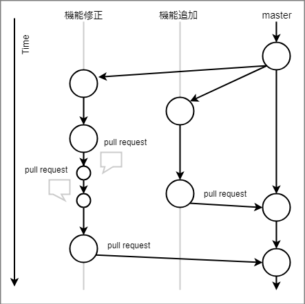

# 教材(GitHub)

## GitHub

GitHub とは、ローカルにある Git リポジトリをアップロードして、簡単に共同作業やプログラムの配布ができる Web サービスです。ローカルではなく、インターネット上にあるリポジトリのことを `リモートリポジトリ` といいます。

## GitHub Flow



`GitHub Flow` とは、既存の `git-flow` の手順をシンプルにした開発フローである。

GitHub Flow は以下のようなフローで行われている。

- master ブランチのものは何であれデプロイ可能(利用可能な状態)である
- 新しい何かに取り組む際は、説明的な名前のブランチを master から作成する
- 作成したブランチにローカルでコミットし、サーバー上の同じ名前のブランチにも定期的に作業内容を push する
- フィードバックや助言が欲しい時や、ブランチをマージしてもよいと思ったときは、プルリクエストを作成する
- 他の誰かがレビューをして機能に OK を出してくれたら、あなたはコードを master へマージすることができる
- マージをして master へ push したら、直ちにデプロイをする

git-flow に対してブランチの分岐をシンプルにし、 GitHub のプルリクエスト機能を活かしたフローとなっている。

## 既存のプロジェクトに参加してみよう

他人のリポジトリをローカルにダウンロードするには、 `クローン(clone)` という操作をします。しかし、他人のリポジトリに参加するには、事前に `フォーク(fork)` する必要があります。フォークすると、自分のアカウント上にリポジトリのコピーが生成され、それをクローンすることで編集が可能になります。

(フォークとクローンの図を入れる)

## 既存のプロジェクトに参加してみよう: 問題

GitHub Flow を用いて、既存のプロジェクトにファイルを追加してみましょう。今回の作業の流れは

- フォーク(fork)
- クローン(clone)
- ブランチを切る
- 新しく制作したブランチ上で編集
- ブランチをプッシュ(push)

のようになります。

今回使用するリモートリポジトリは <https://github.com/hoge/hoge> です。リンク先のリポジトリにアクセスして、右上の fork ボタンを押します。

fork が成功したら、 GitHub の自分のユーザーページにアクセスし、hogehoge というリポジトリにアクセスします。そして、画面の右中央の `Clone or download` をクリックしてリポジトリの HTTPS の URL をコピーしましょう。コピーしたらターミナルでローカルにクローンしてみましょう。

```bash
git clone コピーしたURL
```

クローンに成功したら、今いる場所にリポジトリ名のディレクトリが作成されます。その中に入り、ブランチを切りましょう。今回は学籍番号でつけてみましょう。

```bash
cd hogehoge
git branch ht17a000 # 学籍番号の名前でブランチを作成
git checkout ht17a000 # 作成したブランチに切り替える
# 'git status' で現在のブランチの確認
```

ブランチを切り替えたら、 <https://github.com/hoge/hoge> の README.md に書いてある方法で作業を始めましょう。

```bash
cp question.md submit/ht17a000.md # question.md を ht17a000.md という名前で submit というディレクトリ内にコピー
```

コピーをし終えたら、コピーしたファイルを開いて編集しましょう。

(エディターを用意する？)

作業が終わったら作成したファイルをコミットして、リモートリポジトリにプッシュ(push)しましょう。リモートリポジトリからクローンした時点で、リモートリポジトリには `origin` という名前が付けられています。

```bash
git push origin ht17a000 # origin というリモート先のリポジトリに学籍番号のブランチを送信
```

プッシュに成功したら、フォーク元か自分のリポジトリを参照しに行きましょう。クローンするときに選択したボタンの上に「最近プッシュされたブランチ」が表示されるので、右側の `[Compare & pull request]` を選択して `プルリクエスト(pull request)` を作成しましょう。

作成画面では、プルリクエストのタイトルと説明の入力欄が表示されます。他にはプルリクエストに関連するコミットと変更内容、ブランチ元との差分が表示されます。

元リポジトリのオーナーにプルしてもらうために、変更内容がわかりやすいようにタイトルと説明を書きましょう。

入力したら `[Create pull request]` を選択して完了です。元リポジトリのオーナーにマージされたら、あなたの変更が元のプロジェクトに反映されます！（マージされない場合の記述）
